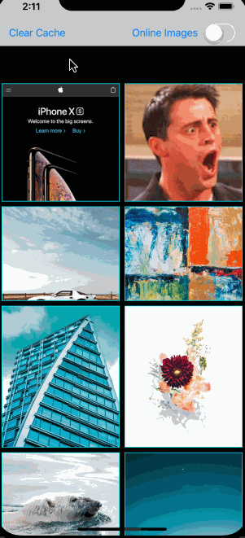
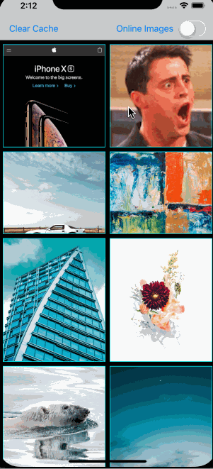

# SlidingPhoto

The Swift version of [PhotoBrowser](https://github.com/cuzv/PhotoBrowser).

## How does it look like?

&nbsp;&nbsp;

## How to use

Supports CocoaPods & Carthage integration.

For the detail usages please check out the example in project.

## License

`SlidingPhoto` is available under the MIT license. See the LICENSE file for more info.
